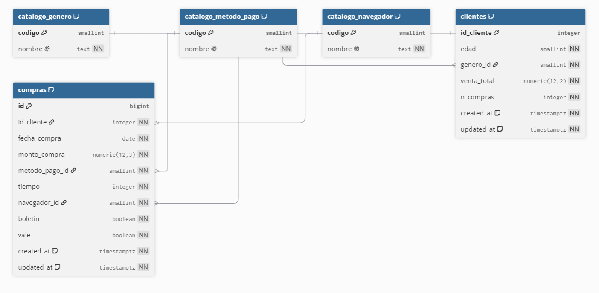

# Universidad de San Carlos de Guatemala

**Facultad de Ingeniería**

**Escuela de Ciencias y Sistemas**

SISTEMAS ORGANIZACIONALES Y GERENCIALES 2

---

# INFORME TÉCNICO — ANÁLISIS DE VENTAS ONLINE 2021 Y AGENTE CONVERSACIONAL PARA LA EXPANSIÓN A SUCURSAL FÍSICA

Práctica 1 · Segundo semestre 2026

| Nombre y apellido | Carnet |
|---|---|
| Enner Esaí Mendizabal Castro | 202302220 |
| Emilio *[completar apellidos]* | *[carnet]* |
| Vela *[completar nombre]* | 202307705 |
| Helado *[completar nombre]* | *[carnet]* |
| Brandon *[completar apellidos]* | *[carnet]* |

**Grupo:** *[número]*

**Archivo de entrega:** `SOG2-2S26_grupo#.pdf`

Jueves 12 de agosto de 2026

---

> Nota para pasar a Word: deja el sello USAC en la portada. Copia este archivo sección por sección. Donde hay una figura, inserta el PNG. Completa nombres, carnets y número de grupo. El ER ya está en `db/schema.png`.

---

## Índice

1. [Resumen ejecutivo](#1-resumen-ejecutivo)
2. [Presentación](#2-presentación)
3. [Planificación](#3-planificación)
4. [Proceso de análisis](#4-proceso-de-análisis)
5. [Metodología de visualización](#5-metodología-de-visualización)
6. [Resultados](#6-resultados)
7. [Conclusiones](#7-conclusiones)
8. [Recomendaciones](#8-recomendaciones)
9. [Respuestas a las preguntas del enunciado](#9-respuestas-a-las-preguntas-del-enunciado)
10. [Diagrama de la base de datos](#10-diagrama-de-la-base-de-datos)
11. [Código](#11-código)
12. [Referencias técnicas](#12-referencias-técnicas)

---

## 1. Resumen ejecutivo

El presente informe documenta el trabajo de un equipo de analistas junior ante un problema de inteligencia organizacional: una empresa que durante 2021 operó ventas a distancia desea abrir una sucursal física y, al mismo tiempo, disponer de un asistente conversacional capaz de entregar los análisis bajo demanda, sin esperar un reporte estático cada vez que gerencia formula una pregunta.

La evidencia empírica proviene de 6,500 registros de clientes (un identificador por fila) contenidos en `venta_online_c.csv`. Tras verificar nulos, duplicados y tipos, los datos se cargaron a una base relacional PostgreSQL alojada en Supabase (proyecto `sog2-ventas-2021`, región São Paulo). Sobre esa fuente se calcularon estadísticos descriptivos, tendencias mensuales, segmentaciones y pruebas de correlación. Ocho gráficos de tipos distintos resumen los hallazgos. Un servidor MCP y un agente Google ADK con Gemini 3.5 Flash-Lite permiten consultar los puntos 2 a 6 del enunciado en lenguaje natural.

Los resultados más accionables son cuatro. Primero, marzo concentra el mayor monto (Q 22,994.34) y noviembre el menor (Q 19,779.24); el calendario comercial de la sucursal no debería ser plano. Segundo, el canal etiquetado como Tienda Física ya es el más frecuente (3,523 transacciones), de modo que la expansión presencial no parte de cero. Tercero, la tarjeta de crédito domina el mix de pago; el efectivo —interpretado también como contra entrega— representa el 18.57 % de las transacciones. Cuarto, el segmento que combina boletín y vale exhibe la venta promedio más alta (Q 242.57), mientras que la edad y el género apenas diferencian el ticket: la correlación edad–venta total es prácticamente nula (r de Pearson = −0.025).

Se recomienda priorizar inventario y campañas en el primer trimestre, no invertir en el Navegador 4, diseñar un paquete promocional boletín más vale, y poner el chat de IA al servicio de consultas repetidas de gerencia, siempre anclado a las tools que leen Supabase para no inventar cifras.

---

## 2. Presentación

Este documento se elabora en el rol de analista de datos junior para el curso Sistemas Organizacionales y Gerenciales 2, Escuela de Ciencias y Sistemas, Facultad de Ingeniería, Universidad de San Carlos de Guatemala. El tono es el de un informe final interno: describe qué se hizo, por qué se tomaron ciertas decisiones y qué implica eso para una empresa que deja de ser exclusivamente digital.

El enunciado plantea un escenario de negocio concreto. La organización ha vendido en línea durante 2021 y ahora quiere una sucursal física. En paralelo, decide que una inteligencia artificial entregue los análisis cuando se soliciten, con el fin de acortar el tiempo entre una pregunta gerencial y una cifra verificable. El archivo fuente incluye identificador de cliente, edad, género, venta total, número de compras, fecha, monto de la compra, método de pago, tiempo, navegador, boletín y vale. Los catálogos están codificados: género 1 femenino y 0 masculino; método de pago 0 efectivo, 1 crédito y 2 débito; navegador 0 tienda física y 1 a 4 navegadores web; boletín y vale 1 sí y 0 no.

El equipo no se limitó a abrir el CSV en una hoja de cálculo. Se construyó un pipeline reproducible en Python, una base relacional en la nube (requisito de calificación y condición para no perder 20 % + 20 % de la nota) y un agente conversacional con Google ADK más un MCP Server, usando Gemini 3.5 Flash-Lite como modelo. Los puntos 2 a 6 del alcance —exploratorio, tendencias, segmentación, correlación y visualización— pueden pedirse al chat; este informe fija la línea base escrita para la entrega en UEDI.

El lector previsto es gerencia y el catedrático. A gerencia le importan meses pico, canales, promociones y qué no vale la pena personalizar. Al catedrático le importa que el análisis coincida con lo solicitado, que la base esté en la nube y que el PDF cubra presentación, planificación, proceso, metodología, conclusiones, diagrama y código.

---

## 3. Planificación

### 3.1 División de tareas

El grupo acordó un desglose operativo por rol, documentado en el plan de trabajo de la práctica 1. Las dependencias se organizaron en cuatro fases: Enner habilita datos e infraestructura; Brandon y Helado consumen la base en paralelo; Vela integra el agente; Emilio consolida el informe.

**Emilio — líder de proyecto y analista de negocio.** Redacta el PDF con el nombre `SOG2-2S26_grupo#.pdf`. Escribe planificación y metodología. Formula las cuatro conclusiones (mínimo veinte líneas cada una) y responde las cinco preguntas estratégicas (8a a 8e). Consolida las diez recomendaciones: dos por integrante.

**Enner — ingeniero de datos y nube.** Extrae y limpia `venta_online_c.csv`. Garantiza tipos decimales, fechas y catálogos. Levanta PostgreSQL en Supabase, carga los 6,500 registros y entrega el modelo entidad-relación en DBML para dbdiagram.io.

**Vela — desarrollo de IA e integración.** Instancia el agente con Google ADK, implementa el MCP Server y conecta Gemini 3.5 Flash-Lite. El chat debe resolver, mediante tools, exploratorio, tendencias, segmentación, correlación y visualización.

**Helado — segmentación y visualización.** Agrupa por edad, género y promociones. Calcula correlaciones (edad–venta, género–pago, boletín–vale). Genera al menos siete tipos de gráfico y deja los PNG para el informe y para el agente.

**Brandon — exploratorio y tendencias.** Se conecta a la base en la nube. Calcula media, mediana y moda. Identifica meses extremo, navegadores más y menos usados, ventas en efectivo y meses de mayor uso de boletín y vale.

### 3.2 Herramientas y justificación

Se eligió **Python** (pandas, NumPy, SciPy, Matplotlib, Seaborn, SQLAlchemy, psycopg) porque cubre limpieza, estadística inferencial y gráficos en un solo lenguaje, alineado con el enunciado (Python o R).

Se eligió **Supabase (PostgreSQL)** porque exige una base relacional en la nube. Un archivo plano no cumple la rúbrica. El esquema se normalizó en catálogos, `clientes` y `compras` para que el diagrama ER sea defendible. Row Level Security quedó activo; el análisis usa `DATABASE_URL` del lado servidor.

Se eligió **Google ADK + MCP Server** porque son requisitos técnicos explícitos. El modelo es **Gemini 3.5 Flash-Lite**: rápido, con function calling, coherente con el consejo del enunciado de usar Flash o Flash-lite. El agente no calcula “de memoria”: llama tools que leen Supabase o listan figuras locales.

**GitHub** es la plataforma exigida para el código. **dbdiagram.io** genera el PNG del ER a partir de `db/schema.dbml`. Las claves viven en `.env` (no se versionan) y se comparten por un canal privado.

### 3.3 Plazos por fase

| Fase | Contenido | Dependencia |
|---|---|---|
| 1 (bloqueante) | ETL, tipos, carga a Supabase, DBML | Nada |
| 2 (paralela) | Estadísticos, tendencias, segmentación, ≥7 gráficos | Fase 1 |
| 3 (paralela) | ADK + MCP + Gemini | Fases 1 y 2 (tools reutilizan las mismas consultas) |
| 4 (cierre) | Informe, figuras, ER, respuestas | Fases 1–3 |

La fase 1 es bloqueante porque ningún análisis del enunciado debe leer el CSV crudo una vez definida la fuente oficial: la base en la nube. Las fases 2 y 3 pueden solaparse porque el MCP invoca las mismas funciones de `lib/analysis.py` que los scripts 02 a 06. La fase 4 espera cifras y PNG ya materializados en `outputs/`.

---

## 4. Proceso de análisis

### 4.1 Limpieza y preparación

El CSV usa separador `;` y 12 columnas. Se leyeron 6,500 filas. El recuento de nulos por columna fue cero. No hubo duplicados exactos ni `Id_cliente` repetido: cada cliente aparece una vez, con un snapshot de compra en 2021. El rango de fechas, una vez parseado como `DD.MM.YY`, cubre del 1 de enero al 31 de diciembre de 2021.

Las decisiones fueron conservadoras. No se imputó nada porque no había huecos que inventar. No se eliminaron filas. `Venta_total` y `MontoCompra` se convirtieron a numérico decimal. `FechaCompra` pasó a tipo fecha. Género, método de pago, navegador, boletín y vale se validaron contra los códigos del enunciado; todos coincidieron. Boletín y vale se almacenaron como booleanos en Postgres.

La carga no se hizo en una sola tabla plana. Se insertaron tres catálogos (`catalogo_genero`, `catalogo_metodo_pago`, `catalogo_navegador`), luego 6,500 filas en `clientes` y 6,500 en `compras`, con llaves foráneas. La verificación post-carga confirmó igualdad entre filas limpias del CSV y conteos en la nube. Un obstáculo operativo fue que el host directo `db.<ref>.supabase.co` resuelve solo IPv6; en Windows se usó el pooler de sesión IPv4 (`aws-0-sa-east-1.pooler.supabase.com:5432`) con `sslmode=require`.

### 4.2 Decisiones durante el análisis exploratorio

Se unieron siempre los catálogos para no reportar “0” y “1” en el texto gerencial. Se distinguió **MontoCompra** (evento de la fila, base de series mensuales y tickets) de **Venta_total** (valor acumulado del cliente, base de segmentación y de la correlación con edad). Los rangos de edad se fijaron en 18–25, 26–35, 36–45, 46–55 y 56+, cubriendo el mínimo 18 y el máximo 79 observados.

Para el inciso 3c (ventas pagadas contra entrega o en efectivo) se interpretó `MetodoPago = 0` (Efectivo) como efectivo / contra entrega. El enunciado no trae un campo aparte de “contra entrega”; documentar esa equivalencia evita que el lector crea que se inventó una categoría.

Media, mediana y moda se calcularon para edad, venta total, número de compras, monto de compra y tiempo. La comparación media–mediana en `venta_total` (206.24 frente a 137.35) adelantó un sesgo a la derecha que el boxplot y el máximo 3,169 confirman: hay clientes de alto valor que no deben leerse como “el cliente típico”.

### 4.3 Desafíos y cómo se resolvieron

El primer desafío fue de conectividad: Postgres en la nube accesible por IPv6 en el hostname directo. Se resolvió con el connection pooler de sesión y se dejó anotado en `.env.example` para los compañeros.

El segundo fue el CSV de laboratorio: punto y coma, fechas europeas de dos dígitos de año, decimales con punto. Un `read_csv` por defecto habría fallado. Se fijó `sep=";"` y `format="%d.%m.%y"`.

El tercero fue de stack de IA. Google ADK 2.6 exige `mcp>=1.24,<2`. Instalar MCP 2.0 rompió imports (`McpHttpClientFactory`). Se pinneó MCP 1.29 y el servidor se escribió con FastMCP.

El cuarto fue semántico: `Venta_total` no es igual a `MontoCompra`. Usar el campo incorrecto habría distorsionado meses y correlaciones. La regla quedó en código y en las instrucciones del agente.

El quinto, menor, fue Python 3.14 sin rueda de `psycopg2-binary`. Se pasó a `psycopg` v3 con dialecto `postgresql+psycopg://`.

---

## 5. Metodología de visualización

Cada gráfico responde a una pregunta del enunciado, no a un catálogo de “tipos bonitos”. El criterio fue: una pregunta, un encoding visual adecuado, pie de figura con fuente propia a partir de Supabase.

Las **barras** comparan magnitudes entre categorías discretas (mes, navegador). El ojo lee altura, no ángulo. Las **líneas** muestran orden temporal y pendiente; sirven para la tendencia mensual, no para un ranking. El **pastel** se reservó al mix de método de pago (tres partes); con más de cinco categorías se habría evitado. La **dispersión** es el único gráfico que pone dos continuas frente a frente (edad frente a venta total) y permite ver la ausencia de nube inclinada. El **boxplot** resume mediana, rango intercuartílico y atípicos por género, mejor que un par de promedios. El **heatmap** del cruce boletín × vale convierte una tabla de contingencia en color, alineado con la prueba chi-cuadrado. El **histograma** de edad muestra forma y moda en 18, que una sola media (36.31) oculta.

Se generaron ocho figuras, una más del mínimo de siete, para cubrir mes, tendencia, pago, edad–venta, género, promociones, distribución de edad y canal.

---

## 6. Resultados

Salvo indicación contraria, n = 6,500. Montos en la unidad del CSV (se reportan con dos decimales).

### 6.1 Estadísticos descriptivos

| Variable | Media | Mediana | Moda | Desv. est. | Mín. | Máx. |
|---|---:|---:|---:|---:|---:|---:|
| Edad | 36.31 | 36.00 | 18.00 | 11.36 | 18 | 79 |
| Venta_total | 206.24 | 137.35 | 98.00 | 215.55 | 9.00 | 3,169.00 |
| N_Compras | 5.09 | 4.00 | 2.00 | 3.96 | 1 | 25 |
| MontoCompra | 39.79 | 35.76 | 37.15 | 19.52 | 7.24 | 199.35 |
| Tiempo | 767.38 | 768.00 | 852.00 | 181.75 | 180 | 1,443 |

La edad es simétrica en media y mediana; la moda en 18 indica un grupo joven visible. La venta total está sesgada: la media supera a la mediana y la desviación (215.55) es del orden de la propia media. El cliente típico no es el de Q 206; es más cercano a Q 137. El ticket de la transacción de la fila (`MontoCompra`) es mucho más estable (mediana 35.76). El tiempo se concentra alrededor de 768, con moda 852.

### 6.2 Ventas por mes

| Mes | Monto | Transacciones | Ticket promedio |
|---|---:|---:|---:|
| Enero | 20,315.90 | 520 | 39.07 |
| Febrero | 21,438.81 | 545 | 39.34 |
| Marzo | 22,994.34 | 569 | 40.41 |
| Abril | 22,468.97 | 557 | 40.34 |
| Mayo | 20,944.68 | 530 | 39.52 |
| Junio | 22,393.60 | 543 | 41.24 |
| Julio | 22,085.58 | 565 | 39.09 |
| Agosto | 21,190.51 | 530 | 39.98 |
| Septiembre | 20,074.83 | 508 | 39.52 |
| Octubre | 22,151.33 | 563 | 39.35 |
| Noviembre | 19,779.24 | 493 | 40.12 |
| Diciembre | 22,778.09 | 577 | 39.48 |

**Mes de mayores ventas: marzo** (Q 22,994.34; 569 transacciones). **Mes de menores ventas: noviembre** (Q 19,779.24; 493 transacciones). Diciembre tiene más transacciones (577) que marzo, pero no el mayor monto: el ticket de marzo (40.41) supera al de diciembre (39.48). Junio registra el ticket promedio más alto (41.24). La amplitud entre pico y valle es de unos Q 3,215, alrededor del 14 % del mes más bajo: no es un colapso, pero sí un ciclo que la sucursal debe planificar.


*Figura 1. Distribución del monto de compra por mes, 2021. Fuente: elaboración propia a partir de Supabase.*


*Figura 2. Serie mensual de ventas. Fuente: elaboración propia a partir de Supabase.*

### 6.3 Método de pago, navegador, boletín y vale

| Método de pago | Transacciones | Monto | Ticket promedio |
|---|---:|---:|---:|
| Tarjeta de crédito | 3,827 | 152,601.47 | 39.87 |
| Tarjeta de débito | 1,466 | 58,548.74 | 39.94 |
| Efectivo (contra entrega) | 1,207 | 47,465.64 | 39.33 |

El crédito concentra el 58.9 % de las transacciones y el 59.0 % del monto. El débito, 22.6 % de las transacciones. El efectivo, 18.57 % de las transacciones y Q 47,465.64. Los tickets son parecidos (39.3 a 39.9): el mix cambia volumen, no el tamaño típico de la compra.


*Figura 3. Composición de ventas por método de pago. Fuente: elaboración propia a partir de Supabase.*

| Canal / navegador | Transacciones | Monto | Ticket promedio |
|---|---:|---:|---:|
| Tienda física | 3,523 | 140,332.26 | 39.83 |
| Navegador 1 | 1,273 | 51,323.34 | 40.32 |
| Navegador 2 | 847 | 33,405.46 | 39.44 |
| Navegador 3 | 660 | 25,412.70 | 38.50 |
| Navegador 4 | 197 | 8,142.10 | 41.33 |

**Canal más popular: tienda física** (54.2 % de las filas). **Menos popular: Navegador 4** (3.0 %). El ticket del Navegador 4 es el más alto (41.33), pero el volumen no justifica priorizarlo. Navegador 1 es el segundo canal y el natural complemento digital de la sucursal.


*Figura 4. Monto de compra según canal. Fuente: elaboración propia a partir de Supabase.*

Boletín: 2,921 sí (ticket 40.84) frente a 3,579 no (ticket 38.93). Vale: 1,254 sí (ticket 44.95) frente a 5,246 no (ticket 38.55). El vale, aunque menos frecuente, se asocia a un ticket claramente mayor. El mes con más boletines es **diciembre** (262); el mes con más vales es **marzo** (133). Septiembre es el mes con menos boletines (200); octubre, el de menos vales (85).

### 6.4 Segmentación de clientes


*Figura 5. Distribución de la edad. Fuente: elaboración propia a partir de Supabase.*

| Rango de edad | n | Venta promedio | Monto promedio | Compras promedio |
|---|---:|---:|---:|---:|
| 18–25 | 1,249 | 207.82 | 38.78 | 5.27 |
| 26–35 | 1,946 | 212.66 | 39.81 | 5.25 |
| 36–45 | 1,946 | 204.70 | 39.83 | 5.04 |
| 46–55 | 1,013 | 199.63 | 40.96 | 4.78 |
| 56+ | 346 | 192.46 | 39.60 | 4.73 |

Los tramos 26–35 y 36–45 empatan en tamaño (1,946). El valor de cliente más alto está en 26–35 (Q 212.66). A partir de 46 años bajan las compras acumuladas, no tanto el ticket de la fila. La sucursal no debería diseñar góndolas “por edad” esperando tickets muy distintos; sí puede esperar más frecuencia de compra en menores de 36 años.

| Género | n | Venta promedio | Monto promedio | Compras promedio | % boletín | % vale |
|---|---:|---:|---:|---:|---:|---:|
| Femenino | 3,128 | 208.16 | 39.88 | 5.09 | 45.3 | 19.6 |
| Masculino | 3,372 | 204.46 | 39.70 | 5.09 | 44.6 | 19.0 |

La diferencia de venta promedio entre géneros es de unos Q 3.70 (menos del 2 %). Las tasas de boletín y vale son casi iguales. El comportamiento de compra no justifica catálogos o promociones “para mujeres” frente a “para hombres” con estos datos.

| Segmento promocional | n | Venta promedio | Monto promedio |
|---|---:|---:|---:|
| Boletín y vale | 811 | 242.57 | 45.68 |
| Solo boletín | 2,110 | 233.80 | 38.98 |
| Sin promoción | 3,136 | 183.33 | 38.26 |
| Solo vale | 443 | 170.66 | 43.62 |

Quien combina boletín y vale es el cliente de mayor valor (Q 242.57). El vale solo, sin boletín, muestra el valor de cliente más bajo (Q 170.66) aunque el monto de la transacción sea alto (43.62): son pocos (443) y no acumulan tantas compras. La palanca comercial no es “regalar vales sueltos”, sino **atar el vale a la suscripción del boletín**.

### 6.5 Correlación

**Edad y venta total.** Pearson r = −0.025 (p = 0.042). Spearman ρ = −0.030 (p = 0.016). El signo es levemente negativo y el tamaño del efecto es despreciable. El p-valor bajo se explica por n = 6,500, no por una relación útil. En la práctica: conocer la edad no permite predecir el valor del cliente.


*Figura 6. Nube de puntos edad–venta total, coloreada por género. No se observa pendiente clara. Fuente: elaboración propia a partir de Supabase.*


*Figura 7. Distribución de venta total según género. Medianas y colas similares. Fuente: elaboración propia a partir de Supabase.*

**Género y método de pago.** Chi-cuadrado = 3.73, p = 0.155. No se rechaza independencia al 5 %. Femenino: 606 efectivo, 1,806 crédito, 716 débito. Masculino: 601 efectivo, 2,021 crédito, 750 débito. Ambos prefieren crédito; no hay un “método de mujeres” distinto al de hombres.

**Boletín y vale.** Chi-cuadrado = 243.57, p ≈ 6.57 × 10⁻⁵⁵. Hay asociación fuerte.

|  | Vale no | Vale sí |
|---|---:|---:|
| Boletín no | 3,136 | 443 |
| Boletín sí | 2,110 | 811 |

Entre quienes no tienen boletín, el vale aparece en 443 / 3,579 ≈ 12.4 %. Entre quienes sí tienen boletín, 811 / 2,921 ≈ 27.8 %. El vale es más del doble de frecuente si hay boletín. Eso respalda el paquete combinado observado en la segmentación.


*Figura 8. Cruce porcentual de boletín y vale. Fuente: elaboración propia a partir de Supabase.*

---

## 7. Conclusiones

### Conclusión 1. El calendario de 2021 no es plano: marzo empuja el año y noviembre lo frena, y eso debe gobernar inventario, turnos y campañas de la sucursal física

La serie mensual de 2021 muestra un ciclo reconocible, no un ruido aleatorio alrededor de un promedio. Marzo concentra el mayor monto (Q 22,994.34) con 569 transacciones y un ticket de Q 40.41, el segundo más alto del año. Noviembre se sitúa en el extremo opuesto: Q 19,779.24 y 493 transacciones, el menor volumen de filas. La diferencia de monto entre ambos meses supera los Q 3,200, una magnitud suficiente para que un gerente de sucursal note faltantes ociosos o cajas subutilizadas si trata todos los meses igual. Diciembre, contra la intuición de “mes navideño único”, lidera en número de transacciones (577) pero no en monto; el ticket (Q 39.48) no alcanza al de marzo ni al de junio (Q 41.24). Eso sugiere que el cierre de año trae más visitas o más órdenes, no necesariamente tickets más gordos.

Para una empresa que abre sucursal física, el dato no es anecdótico. El canal ya etiquetado como tienda física es el más usado en el propio dataset (3,523 filas). La operación presencial heredará, con alta probabilidad, el mismo pulso estacional que el canal digital. Planear contrataciones temporales en marzo y no en noviembre, o al revés, cambia el costo laboral. El inventario de productos de rotación rápida debería adelantarse a febrero para no llegar tarde al pico. Junio, con el mejor ticket, es un segundo momento de empuje que conviene no diluir en “el semestre”.

El valle de noviembre coincide con relativamente pocas transacciones, no con un ticket hundido (Q 40.12, incluso por encima de varios meses “buenos”). El problema de noviembre es afluencia, no tacañería del cliente que sí compra. Una sucursal que interprete mal ese mes podría bajar precios innecesariamente en lugar de estimular tráfico (eventos, boletín de noviembre, horarios). Septiembre también es flojo en monto (Q 20,074.83) y es el mes con menos uso de boletín (200), lo que refuerza la lectura de un segundo semestre con dos baches (septiembre y noviembre) antes del rebote de diciembre.

Desde el punto de vista del analista junior, la recomendación no es “hacer un dashboard bonito de meses”, sino convertir la tabla mensual en un calendario operativo: cupo de personal, pedido a proveedores, presupuesto de pauta y fecha de envío de boletín. El chat de IA puede devolver esta tabla en segundos, pero la decisión de surtir más en febrero sigue siendo humana. Ignorar el ciclo sería repetir en la sucursal el error clásico de dimensionar la operación con el promedio anual (alrededor de Q 21,500 al mes) y luego sorprenderse en marzo y en noviembre.

En síntesis, 2021 enseña que el año comercial tiene un hombro alto en el primer trimestre (febrero–abril), un segundo aire a mitad de año (junio–julio y octubre) y un hueco claro en noviembre. La sucursal física debe nacer con ese mapa, no con doce clones del mes promedio.

### Conclusión 2. La sucursal física no parte de cero: ya es el canal dominante, mientras el Navegador 4 es residual y no merece el mismo esfuerzo

Más de la mitad de las observaciones (3,523 de 6,500, 54.2 %) están clasificadas como tienda física (código 0 de navegador). El monto asociado (Q 140,332.26) duplica con creces al del Navegador 1 (Q 51,323.34) y deja muy atrás a los navegadores 2, 3 y 4. El hallazgo es contraintuitivo si se lee el enunciado como “empresa 100 % online”: el propio archivo de 2021 ya registra un canal presencial mayoritario, o al menos un canal etiquetado así. Para gerencia, eso reduce el riesgo percibido de “inventar un formato nuevo”. La sucursal amplía algo que los datos ya muestran como hábito, no una apuesta ciega.

El Navegador 1 es el segundo canal (1,273 transacciones, ticket Q 40.32, el segundo más alto). Es el candidato natural a “experiencia web oficial” complementaria a la tienda. Los navegadores 2 y 3 aportan volumen medio (847 y 660) con tickets algo menores. El Navegador 4 apenas suma 197 transacciones (3.0 %) y Q 8,142.10. Su ticket es el más alto (Q 41.33), tentación típica de “invirtamos ahí porque pagan más”. El analista junior debe resistir esa tentación: 197 casos no sostienen una línea de producto, una app exclusiva ni un equipo de soporte. El costo de mantener un canal marginal suele comerse el extra de ticket.

Esta lectura tiene implicaciones de costo. Cada canal adicional (integración, pruebas, capacitación, pauta) tiene un costo fijo. Concentrar calidad de experiencia en tienda física más Navegador 1 cubre 3,523 + 1,273 = 4,796 filas, el 73.8 % del dataset. Añadir esfuerzo serio al Navegador 4 cubre un 3 %. En un escenario de apertura de sucursal, el presupuesto es finito: mejor un local bien atendido y un sitio web sólido que cuatro frentes mediocres.

El ticket similar entre canales (38.5 a 41.3) indica que el canal cambia quién llega, no cuánto deja en caja por visita. Por eso la métrica de popularidad (conteo y monto total) pesa más que el ticket para decidir dónde invertir. El gráfico de barras de navegador y el de pastel de pago, leídos juntos, dicen: el cliente ya elige crédito y ya elige (o ya usa) el canal físico; la sucursal debe perfeccionar esa combinación, no perseguir la cola de la distribución de navegadores.

Queda una cautela metodológica: el código 0 se llama “Tienda Física” en el enunciado, dentro de un archivo de ventas “online”. Es posible que sea un recodificado de un canal no web (app, kiosco, retiro en punto). Aun así, el mensaje gerencial se sostiene: hay un canal no-navegador-1-a-4 que ya es hegemónico. La sucursal física, en el peor caso, formaliza ese canal; en el mejor, lo escala con inventario y horario. El chat de IA puede repetir estos conteos a demanda; la decisión de no gastar en el Navegador 4 es estratégica y debe quedar escrita aquí.

### Conclusión 3. El mix de pago está dominado por crédito; el efectivo es minoritario pero no despreciable, y la sucursal debe recibirlo sin convertirlo en el centro del diseño

De 6,500 transacciones, 3,827 se pagaron con tarjeta de crédito (58.9 %, Q 152,601.47). El débito aporta 1,466 (22.6 %, Q 58,548.74). El efectivo —y, por la interpretación adoptada, la contra entrega— aporta 1,207 transacciones (18.57 %) y Q 47,465.64. Los tres tickets promedios se parecen (39.33 a 39.94). El método de pago, igual que el navegador, mueve volumen más que tamaño de compra. Quien pague en efectivo no es un cliente “más pobre” en este archivo; es simplemente menos frecuente.

Para la sucursal física el 18.57 % no puede ignorarse. Un local que solo acepte tarjetas perdería, en una analogía directa con 2021, casi una de cada cinco transacciones. El costo de una caja, un fondo de cambio y un protocolo de arqueo es el precio de no rechazar a ese quinto. Al mismo tiempo, diseñar la operación “pensada para efectivo” (filas lentas, poco datáfono, poco entrenamiento en cuotas) sería optimizar el 19 % y degradar el 59 % que ya paga con crédito. El punto de equilibrio es: datáfonos confiables como vía principal, efectivo como vía explícitamente soportada, no como vía vergonzante ni como vía reina.

La prueba chi-cuadrado entre género y método de pago (p = 0.155) indica que no hay un patrón de “las mujeres pagan distinto que los hombres”. Femenino y masculino se parecen en la preferencia por crédito (1,806 frente a 2,021). Una campaña de “tarjeta mujer” o de “efectivo hombre” no tiene respaldo. El mix es un rasgo del negocio, no del género.

Operativamente, gerencia puede usar el mix para negociar comisiones con la adquirente: el 59 % de crédito justifica pelear la tasa. El débito (22.6 %) conviene dejarlo visible en caja para no empujar innecesariamente a crédito rotativo. El efectivo, además de caja, en el mundo online se asocia a contra entrega: si la sucursal ofrece retiro en tienda, parte de ese 18.57 % podría migrar a “pago al recoger”, reduciendo fletes fallidos. Eso conecta el inciso 3c del enunciado con un proceso logístico real.

El pastel de método de pago es el gráfico adecuado precisamente porque hay tres partes y una es claramente mayor. No se necesita un modelo predictivo. Se necesita una política de medios de pago escrita antes de inaugurar: qué se acepta, quién autoriza excepciones, cómo se reporta el arqueo, y cómo el chat de IA puede devolver el mix actualizado cuando finanzas pregunte “¿cuánto fue efectivo este mes?”. Los datos de 2021 ya dan la línea base: crédito primero, débito segundo, efectivo tercero y no nulo.

### Conclusión 4. Las promociones combinadas sí marcan valor de cliente; la edad y el género, casi no. La sucursal debe dejar de personalizar por demografía gruesa y empujar el paquete boletín más vale

La correlación entre edad y venta total es, para efectos prácticos, nula: r de Pearson = −0.025, ρ de Spearman = −0.030. Aunque los p-valores caen por debajo de 0.05, el tamaño del efecto no sirve para decidir un planograma ni un CRM. La nube de dispersión no muestra pendiente. Los rangos de edad sí varían un poco (212.66 en 26–35 frente a 192.46 en 56+), pero la brecha es modesta comparada con la brecha promocional. El género tampoco segmenta: venta promedio 208.16 femenino frente a 204.46 masculino, compras promedio idénticas (5.09), tasas de boletín y vale casi iguales. Personalizar por “mujer de 40” frente a “hombre de 25” sería gastar diseño y pauta en una diferencia que el archivo no sostiene.

En cambio, el cruce boletín–vale es el hallazgo más útil del trabajo. Quienes tienen ambos (811 clientes) exhiben venta promedio de Q 242.57 y monto de transacción de Q 45.68, los máximos de la tabla. Quienes no tienen ninguno (3,136, el grupo más grande) se quedan en Q 183.33. El vale solo (443) baja a Q 170.66 de valor de cliente, a pesar de un monto de fila alto (43.62): el vale suelto no construye relación. El chi-cuadrado (243.57, p ≈ 6.6e−55) confirma que boletín y vale no se distribuyen al azar: el vale es más del doble de frecuente cuando hay boletín (27.8 % frente a 12.4 %). Diciembre concentra el uso de boletín (262); marzo, el de vales (133), coincidiendo con el mes de más ventas. Hay una historia coherente: comunicación (boletín) más incentivo (vale) en el momento de mayor demanda.

La implicación para la sucursal es directa. En el punto de venta debe existir un motivo concreto para dejar el correo o el WhatsApp (el “boletín”) y un vale canjeable en la segunda visita, no un descuento suelto de una sola vez. El costo de esa mecánica (impresión, sistema, fraude) se evalúa contra el lift de Q 242.57 frente a Q 183.33, unos Q 59 de valor de cliente. Con 811 personas ya en el segmento alto, el retorno no es teórico. A la inversa, dejar de invertir en microsegmentación etaria libera presupuesto de analítica y de creatividades que no mueven el ticket.

El analista junior debe ser honesto con los límites. Correlación no es causalidad: puede que los clientes valiosos sean quienes se anotan al boletín, y no que el boletín los vuelva valiosos. Aun así, como regla operativa de 2021, el paquete combinado es la palanca observable; la edad no lo es. El heatmap y la tabla de contingencia deben vivir en el informe y en el chat. Cuando gerencia pregunte “¿vale la pena un CRM por edad?”, la respuesta empírica es no. Cuando pregunte “¿empujamos vales a quienes ya leen el boletín?”, la respuesta empírica es sí, sobre todo en marzo y con un refuerzo de boletín en diciembre.

---

## 8. Recomendaciones

Dos acciones concretas por integrante, atribuibles y medibles.

### Enner Esaí Mendizabal Castro

1. **Dejar el ETL y la calidad de datos como rutina mensual, no como evento de la práctica.** Un job que vuelva a validar nulos, duplicados, rangos de catálogo y conteo `clientes` = `compras`, con un log en `outputs/`. Indicador: cero cargas silenciosas con filas huérfanas. Sirve para cuando la sucursal empiece a generar datos 2026 y no se rompa el chat.
2. **Publicar en Supabase una vista gerencial** (ventas del mes, mix de pago, top canal, uso de vale) consultable por el MCP. Indicador: gerencia obtiene esas cuatro cifras en una sola pregunta al chat, sin pedir un CSV.

### Vela (carnet 202307705)

1. **Poner el agente ADK en el flujo semanal de gerencia** (lunes: “¿cómo vamos versus marzo 2021?”). Indicador: al menos cinco preguntas reales de negocio respondidas con tools, no con texto libre, durante el primer mes de uso interno.
2. **Registrar las preguntas que el chat no puede resolver** (SKU, inventario, NPS). Indicador: una lista priorizada de tools nuevas, para no fingir que el MCP cubre lo que el CSV de 2021 no trae.

### Helado

1. **Lanzar una campaña piloto “boletín + vale”** dirigida al tramo 26–35 (n = 1,946, mayor venta promedio). Indicador: porcentaje de clientes que pasan de “solo boletín” o “sin promoción” a “boletín y vale”, y variación de venta promedio frente a Q 242.57 de línea base.
2. **Detener personalización creativa por edad y por género** en la pauta de apertura de sucursal. Indicador: presupuesto creativo reasignado a canal (tienda + Navegador 1) y a promociones combinadas; no a piezas “para 50+” o “para mujeres” sin otra evidencia.

### Brandon

1. **Calendario comercial explícito: empujar febrero–marzo y no desinversión ciega en noviembre.** En noviembre, acciones de tráfico (no de descuento profundo), porque el ticket de ese mes no está caído. Indicador: brecha de transacciones noviembre versus marzo, medida en la sucursal, menor que la de 2021 (569 frente a 493) en el primer año de operación.
2. **No invertir en el Navegador 4; reforzar tienda física y Navegador 1.** Indicador: horas de desarrollo y quetzales de pauta asignados a esos dos canales; Navegador 4 en modo mantenimiento mínimo.

### Emilio

1. **Definir un tablero de tres KPI para la sucursal:** transacciones del mes, mix de crédito/débito/efectivo, y tasa de clientes con boletín y vale. Indicador: el informe mensual de gerencia cabe en una página y coincide con lo que el chat puede responder.
2. **Protocolo de caja para el 18.57 % de efectivo** (fondo, arqueo, contra entrega / retiro en tienda) antes de inaugurar. Indicador: cero días de sucursal abierta sin política escrita de efectivo, y registro del porcentaje de efectivo comparado con 18.57 % de 2021.

---

## 9. Respuestas a las preguntas del enunciado

### 8a. ¿Cómo podrían los insights ayudar a diferenciarse de la competencia?

La diferenciación no sale de “tener un CSV”, sino de operar con un mapa que el competidor genérico no usa. Tres piezas son difíciles de copiar rápido. Primera: saber que el canal físico ya es el mayoritario en 2021 y abrir la sucursal como extensión de un hábito, con inventario calibrado a marzo y a noviembre, no como un experimento tardío. Segunda: tratar el paquete boletín más vale como producto, no como dos palancas sueltas; el competidor que regala vales sin lista de correo está, según estos datos, en el segmento de menor valor de cliente. Tercera: un chat que responde en segundos con cifras de la base en la nube. Mientras otra tienda espera el Excel del analista, gerencia aquí pregunta “¿cuánto fue efectivo?” y obtiene 18.57 % y Q 47,465.64. Esa velocidad, si se ancla a tools y no a alucinaciones, es un servicio interno que se nota en la calidad de las decisiones de piso.

Además, *dejar de hacer* también diferencia. No gastar en el Navegador 4 ni en creatividades por género libera margen. Un competidor que persigue todos los canales y todos los demografías diluye. Este análisis autoriza a decir que no: crédito, tienda física, Navegador 1, pack promocional, calendario marzo–noviembre. La promesa al cliente puede ser simple (horario y stock cuando más compra, vale si se suscribe) en lugar de un discurso de “personalización 360” que los datos no respaldan.

### 8b. ¿Qué decisiones estratégicas podrían tomarse para aumentar ventas y satisfacción?

Con base en 2021, cinco decisiones son coherentes. Una: dimensionar personal e inventario con pico en marzo y segundo aire en junio, octubre y diciembre, y un plan de tráfico (no solo de precio) para noviembre y septiembre. Dos: inaugurar la sucursal con datáfono como vía principal y efectivo como vía soportada, para no perder el 18.57 % ni degradar el 58.9 % de crédito. Tres: convertir el alta al boletín en el momento de caja o de la web, con un vale de segunda compra, especialmente hacia 26–35 años. Cuatro: concentrar la experiencia digital en el Navegador 1 y la experiencia presencial en el local; el resto de navegadores, mantenimiento. Cinco: usar el chat ADK como canal de consultas de mandos medios (mix del día, comparación con 2021), de modo que las decisiones de piso no esperen al informe mensual.

La satisfacción del cliente, con estos campos, se aproxima por fricción: menos quiebres de stock en marzo, menos rechazo de efectivo, un vale que sí se puede canjear, un sitio (Navegador 1) que no compite con tres variantes mediocres. No hay NPS en el archivo; no se debe fingir. Lo que sí hay es evidencia de qué no hace feliz al negocio: vales sueltos, canales de 3 %, y una lectura de que “el cliente mayor gasta distinto”, cuando r ≈ 0.

### 8c. ¿Cómo podría este análisis ayudar a ahorrar costos o mejorar la eficiencia operativa?

Ahorro por omisión: no desarrollar para el Navegador 4 (197 filas). No producir creatividades por género ni por edad para mover el ticket (efectos nulos o triviales). No imputar ni rehacer a mano un CSV que ya estaba limpio: el pipeline evita horas de “limpieza artesanal” en cada consulta. Ahorro por timing: no sobre-contratar en noviembre ni sobre-stockear en el mes más flojo; no llegar tarde a marzo. Ahorro de analista: las preguntas 2 a 6 del enunciado las responde el MCP; el junior deja de repetir el mismo `GROUP BY` mes a mes.

Eficiencia de caja: tickets casi iguales entre métodos de pago implican que el cuello de botella es tiempo de transacción, no mix de monto. Priorizar un flujo de crédito ágil (el 59 %) reduce filas. El 18.57 % de efectivo se diseña como excepción rápida (monto exacto, arqueo), no como el procedimiento largo de todos. Eficiencia promocional: dejar de emitir vales a quienes no están en boletín (443 personas, peor valor de cliente) y concentrar el incentivo en el cruce que ya funciona (811). Cada vale tiene costo; tirarlo al segmento incorrecto es desperdicio.

La base en la nube, con RLS y una sola fuente, evita copias de Excel divergentes entre ventas y gerencia. El costo de “quién tiene el archivo bueno” desaparece si el chat y el informe leen la misma Postgres.

### 8d. ¿Qué datos adicionales se recomendarían?

El CSV de 2021 no trae SKU ni categoría de producto: no se puede decir qué surtir en la góndola de marzo. No trae sucursal versus web en un campo limpio más allá del navegador 0. No trae ciudad, zona ni horario, críticos para una tienda física. No trae costo de adquisición ni margen: venta alta no es utilidad alta. No trae NPS, devoluciones ni quejas. No trae identificador de campaña más fino que boletín/vale. No trae inventario ni quiebres. No trae si `Tiempo` es segundos de sesión, espera de entrega u otra cosa; la moda 852 queda sin interpretación de negocio.

Para un segundo ciclo se recomienda: identificador de transacción (no solo de cliente), líneas de detalle con SKU, costo y margen, canal real (web, app, tienda, contra entrega), sucursal y cajero, timestamp con hora, código postal o municipio, id de campaña, canje efectivo del vale, y un flag de cliente nuevo frente a recurrente. Con eso, el MCP podría responder “qué SKU falta en marzo” y no solo “marzo vendió más”. También convendría un identificador de sesión para saber si `N_Compras` y `Venta_total` se actualizan en vivo o son atributos estáticos de 2021.

### 8e. ¿Implementar un chat conversacional de IA afectaría la entrega del análisis a futuro?

Sí, y de hecho ese es el diseño de esta práctica. El informe PDF sigue siendo la línea base auditada (cifras, gráficos, conclusiones de veinte líneas, recomendaciones nominadas). El chat cambia la *entrega operativa*: gerencia no espera una nueva versión del PDF para preguntar el mes pico o la correlación edad–venta. El agente local (ADK en `127.0.0.1:8000`) envía el texto a Gemini; Gemini llama tools del MCP; el MCP consulta Supabase o lista PNG. Las cifras no viven “en la cabeza del modelo”. Eso reduce el riesgo de alucinación *si* se obliga al uso de tools, como está escrito en las instrucciones del agente.

A futuro, el efecto es mixto. Positivo: menos colas de tickets al analista, misma fuente de verdad, onboarding más rápido de un mando nuevo. Negativo: si alguien pregunta por SKU o por 2026 y el modelo improvisa, la empresa decidirá mal. Por eso Vela debe loguear preguntas sin tool y Enner debe mantener el ETL. El chat no reemplaza al analista junior; lo saca de las consultas repetidas (puntos 2 a 6) y lo deja en el diseño de nuevas métricas y en la vigilancia de calidad. Tampoco reemplaza este informe: la rúbrica pide un PDF. La IA cambia *cómo se consulta* el análisis, no *si existe* un documento responsable.

Implementarlo implica costo de API (Gemini Flash-Lite es el punto barato), costo de mantener el MCP alineado al esquema, y disciplina de no poner `service_role` en un frontend. Con esas condiciones, sí afecta —a favor— la entrega futura del análisis.

---

## 10. Diagrama de la base de datos

El modelo es relacional (PostgreSQL en Supabase). No se dejó una tabla única equivalente al CSV.

El PNG del ER está en el repositorio. En Word: Insertar > Imagen > `db/schema.png`. El origen editable es `db/schema.dbml` (dbdiagram.io).



*Figura 9. ER: catálogos, clientes y compras. Fuente: elaboración propia a partir de `db/schema.dbml` / dbdiagram.io.*

**Entidades**

- `catalogo_genero` (0 Masculino, 1 Femenino)
- `catalogo_metodo_pago` (0 Efectivo / contra entrega, 1 Tarjeta de crédito, 2 Tarjeta de débito)
- `catalogo_navegador` (0 Tienda física, 1–4 navegadores)
- `clientes` (`id_cliente`, `edad`, `genero_id`, `venta_total`, `n_compras`)
- `compras` (`id`, `id_cliente`, `fecha_compra`, `monto_compra`, `metodo_pago_id`, `tiempo`, `navegador_id`, `boletin`, `vale`)

Relaciones: `clientes.genero_id` → `catalogo_genero`; `compras.id_cliente` → `clientes`; `compras.metodo_pago_id` → `catalogo_metodo_pago`; `compras.navegador_id` → `catalogo_navegador`. RLS activo en todas las tablas públicas.

---

## 11. Código

El código completo está en el repositorio GitHub del grupo. Estructura:

```
01_preparacion/etl.py          # punto 1
02_exploratorio/explorar.py    # punto 2
03_tendencias/tendencias.py    # punto 3
04_segmentacion/segmentar.py   # punto 4
05_correlacion/correlacion.py  # punto 5
06_visualizacion/visualizar.py # punto 6
lib/analysis.py, lib/plots.py, lib/db.py
mcp_server/server.py           # tools MCP (puntos 2–6)
agent/agent.py                 # Google ADK + Gemini 3.5 Flash-Lite
supabase/migrations/           # esquema + RLS
db/schema.dbml
run_all.py
```

Ejecución: `python run_all.py` (requiere `.env`). Chat: `.venv/Scripts/adk.exe web --host 127.0.0.1 --port 8000 .`

No se incluyen secretos. Las variables se documentan en `.env.example`. El CSV origen es `docs/venta_online_c.csv` (copia en `data/raw/`).

---

## 12. Referencias técnicas

- Enunciado de la práctica, Sistemas Organizacionales y Gerenciales 2, segundo semestre 2026.
- Plan de trabajo interno del grupo (roles Emilio, Enner, Vela, Helado, Brandon).
- Salidas reproducibles: `outputs/01_preparacion.json` … `outputs/06_visualizacion.json`.
- Google Agent Development Kit; Model Context Protocol; Gemini 3.5 Flash-Lite; Supabase PostgreSQL.

---

## Anexo. Rúbrica de puntuación (para calificación)

| Área | Puntos totales | Puntos obtenidos |
|---|---:|---|
| Utiliza herramientas de análisis de datos | 30 | |
| Aplica herramientas actuales de IA para el análisis de datos | 30 | |
| Subtotal habilidades | 60 | |
| Analiza de forma coherente lo solicitado | 20 | |
| Presenta PDF con todos los puntos | 20 | |
| Subtotal conocimiento | 40 | |
| **Total** | **100** | |
